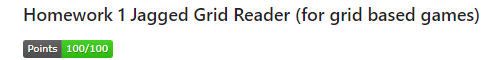
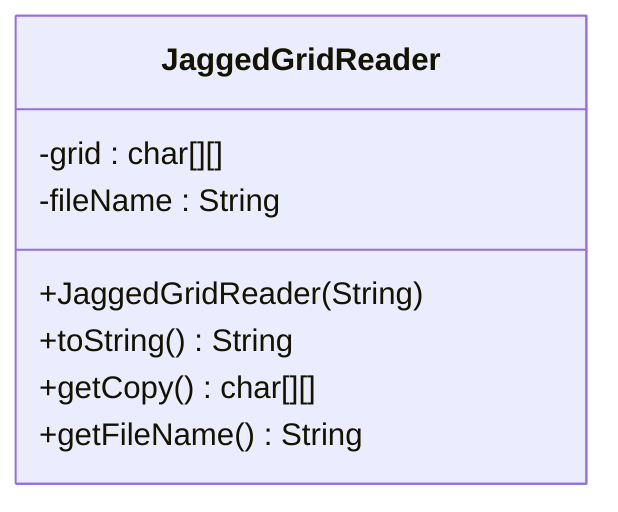

### DISCLAIMER: Autograding Result is not correctly shown. This repository was cloned to my public GitHub after successfully completing it as part of a University CS course. Credit for the creation of the assignment is https://github.com/WCU-CS-CooperLab
| Image of Score from Original Repository |
|-------------------------------------------------------------|
||


<<<<<<< HEAD
[](https://classroom.github.com/online_ide?assignment_repo_id=10018193&assignment_repo_type=AssignmentRepo)
# CSC 240 Computer Science III
### Homework 1  Jagged Grid Reader (for grid based games)

[](../../actions)

## Introduction

Grid Based games such as *tic-tac-toe*, *Connect 4*, *chess*, *checkers*, *battleship*, *sudoku*, and *crossword puzzles* often represent the board on a 2 dimensional array of characters. For this assignment you'll be making a class that reads in a saved state of one of these games so that it could be used as a game loader. Once the game is loaded, a game can get a copy of the state from the Jagged Grid Reader and use it. The other half of this would be a JaggedGridWriter which is outside the scope of this assignment.

*For your version of the Jagged Grid Reader, Your solution will need to be more general than a rectangular grid. You'll be able to handle files that have differing numbers of columns. So, you'll need to use a two dimensional ragged array, and the file should not hold any meta-information about the shape of the grid such as its length and width. Instead, your program will treat each line in the file as one row of the grid and use the length of the string on that line as the number of characters for that row.*

**Note:** The grid will be stored verbatim, and the number of rows and columns will not be stored in the file.
For example a grid could be used to store the state of a heads or tails game, so the grid would be a single character in a file `.` for nothing, `h` for heads,or `t` for tails. A two player rock-paper-scissors game could be stored as two characters, each being `.` for nothing, `r` for rock, `p` for paper, or `s` for scissors.


Some examples of game representations follow:

***Heads-or-Tails***

| Initial State | End State |
|----|----|
|<pre>.</pre>|<pre>H</pre>|

***2 Player Rock-Paper-Scissors***

| Initial State | End State |
|----|----|
|<pre>..</pre>|<pre>RP</pre>|


***Tic-Tac-Toe***  

| Initial State | Intermediate State | End State |
|----|----|----|
|<pre>...<br>...<br>...</pre>|<pre>...<br>.X.<br>..O</pre>|<pre>...<br>XXX<br>.OO</pre>|

***Connect Four (winning state)***  
Key:  
`#` - black  
`%` - red  

File contents:  
```
.......
.......
.......
.......
..###..
.%%%%..
```

***Sudoku (solved)***  

```
123456789
456789123
789123456
234567891
567891234
891234567
345678912
678912345
912345678
```


## Requirements

For this assignment, you'll be developing on java class `JaggedGridReader` and one java program `GameFileTester` that will test the class. 

The class that you will create is:

- `JaggedGridReader` - an object for reading files into a 2-D array. When the JaggedGridReader constructor is called, it should, store the filename, read the specified file and convert it to a two dimensional array of characters and store it in the `grid` field. The `toString()` method should return a string that is identical to the contents of the file. `getCopy()` should return a deep copy of the `grid` or `null` if the file specified was not found. `getFileName()` should return the file name specified on construction. The UML diagram for `JaggedGridReader` is below. 




In addition you should create a program in a file called `GameFileTester.java` that reads in a grid that represents your favorite grid based game *that has at least 9 cells*. Make sure to upload the file that your GameFileTester is reading. Also make sure that the program runs without any request for input or any need for command line arguments. 

**Extra Credit:** *For up to 20 points of **Extra Credit*** have your tester change the grid from the initial state that is read in to a winning game state. Both the initial state and the winning state should be printed below text in your output that says `EXTRA CREDIT`. The number of points awarded will be based on how the winning state was acheived. **5 points** for a trivial change to the array. **10 points** for changes to the array that involve a loop. **20 points** for changes to the array based on simulating the game play. All extra credit should be based on your own solution and should not reference other sources. If you work on a team to do the extra credit, then you all must credit each other and the points will be distributed equally among those credited.


### Class description
`JaggedGridReader` - an object for reading files into a 2-D array. 
- fields
  - grid: the two dimensional `char` array that holds the file contents
  - fileName: the name of the file where the `grid` originated.
- methods
  - `JaggedGridReader(...)`: When the `JaggedGridReader` constructor is called, it should, store the file name, read the specified file and convert it to a two dimensional array of characters and store it in the `grid` field.
  - `toString()`: this method should return a string that is identical to the contents of the file. 
  - `getCopy()`: this method should return a deep copy of the `grid` or `null` if the file specified was not found. 
  - `getFileName()`: this method should return the file name specified on construction. 


### Submission

When you submit your files to this repository they will be tested with the GitHub classroom autograding system. You can submit as many versions of each file until all of the tests pass.

The first tests will test the `JaggedGridReader` on one file.  There are 4 tests for 20 points each.
The last tests will run `GameFileTester`. If `GameFileTester` runs, then you will get 20 points.
If `GameFileTester` prints `EXTRA CREDIT`, then you will see 1 extra credit point and your extra credit will be evaluated by the instructor.


=======
# Jagged-Grid-Reader
>>>>>>> 7e16ad69892d426354d4ca7c6af42a23f4b778f0
